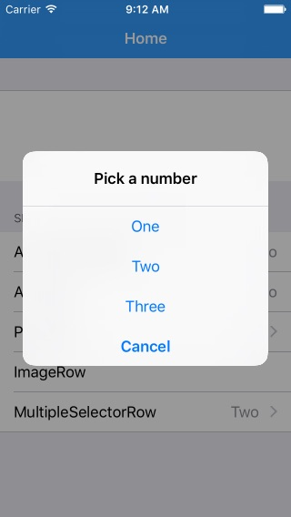
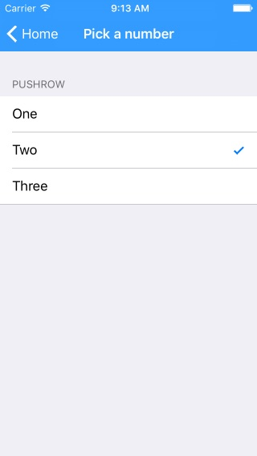

# eureka various tests

Migrate examples of eureka library (Elegant iOS form builder)

## Screenshots
Overview

<table>
  <tr>
    <th>
      
    </th>
    <th>
      
    </th>
    <th>
    
    </th>
  </tr>
</table>

<table>
  <tr>
    <th>
      
    </th>
    <th>
      
    </th>
  </tr>
</table>

two sections with standard rows

Dynamically hide and show rows (or sections)

Multivalued Sections

Controls Rows

<table>
    <tr>
        <td>
<b>Label Row</b> 
        
        
  
        </td>
        <td>
<b>Button Row</b> 
        
        
  
        </td>
        <td>
<b>Check Row</b> 
        
        
  
        </td>
    </tr>
    <tr>
        <td>
<b>Switch Row</b> 
        
        
  
        </td>
        <td>
<b>Slider Row</b> 
        
        
  
        </td>
        <td>
<b>Stepper Row</b> 
        
        
  
        </td>
    </tr>
    <tr>
        <td>
<b>Text Area Row</b> 
        
        
  
        </td>
    </tr>
</table>

Field Rows

<table>
<tr>
  <td>
    
  </td>
  <td>
  TextRow  
  NameRow  
  URLRow  
  IntRow  
  PhoneRow  
  PasswordRow  
  EmailRow  
  DecimalRow  
  TwitterRow  
  AccountRow  
  ZipCodeRow
  </td>
<tr>
</table>

Date Rows

<table>
<tr>
<td>

<b>Date Row</b>

 
Picker shown in the keyboard.

</td>
<td>

<b>Date Row (Inline)</b>

 
The row expands.

</td>
<td>

<b>Date Row (Picker)</b>

 
The picker is always visible.

</td>
</tr>
</table>

Option Rows

<table>
<tr>
<td width="25%">

<b>Alert Row</b> 

 
Will show an alert with the options to choose from.

</td>
<td width="25%">

<b>ActionSheet Row</b> 

 
Will show an action sheet with the options to choose from.

</td>
<td width="25%">

<b>Push Row</b> 

 
Will push to a new controller from where to choose options listed using Check rows.

</td>
<td width="25%">

<b>Multiple Selector Row</b> 

 
Like PushRow but allows the selection of multiple options.

</td>
</tr>
</table>

<table>
    <tr>
        <td>
<b>Segmented Row</b> 
        
        

        </td>
        <td>
<b>Segmented Row (w/Title)</b> 
        
        

        </td>
        <td>
<b>Picker Row</b> 
        
         Presents options of a generic type through a picker view
         <b>(There is also Picker Inline Row)</b>
        

        </td>
    </tr>
</table>

Built your own custom row?
(LocationRow)

---

Source:

- [Eureka](https://github.com/xmartlabs/Eureka)
